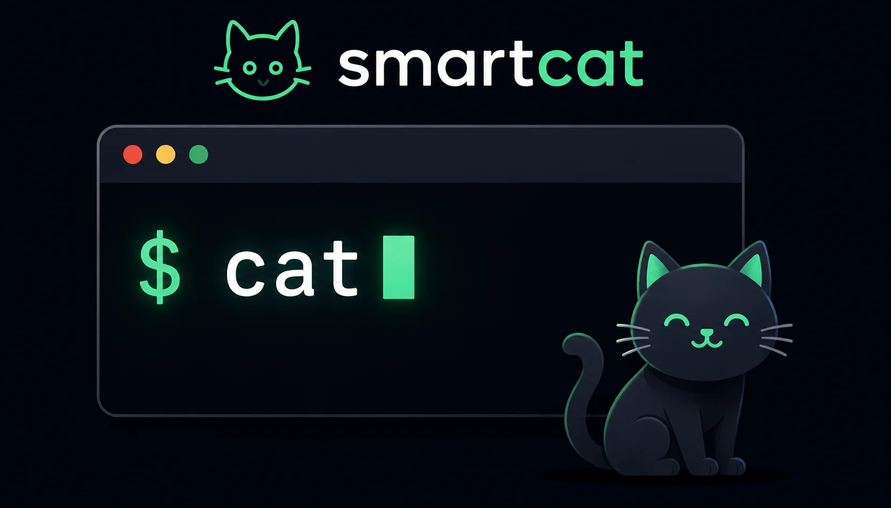
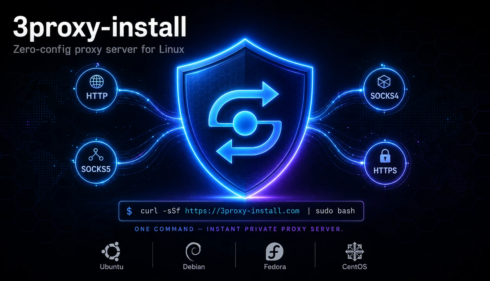

## About Me

I'm **Anton Osenenko**, a DevOps Platform Engineer based in Warsaw, Poland.
With 15+ years in software development and deep infrastructure experience, I build cloud-native, automated, and production-grade systems.

I design AWS infrastructures from scratch, migrate systems to Kubernetes, and build CI/CD pipelines that scale. My focus is on clarity, automation, and reliability - from Terraform modules and CDKTF setups to real-time pipelines and observability stacks.

## What I Do

- Design and codify infrastructure with Terraform & CDKTF
- Build reproducible, compliant cloud platforms on AWS
- Automate CI/CD and deployment workflows
- Optimize observability and incident response
- Keep systems efficient, secure, and reliable

## Projects

<table>
<tr>
<td width="50%" valign="top">
  <h3><a href="https://github.com/a0s/smartcat">smartcat</a></h3>
  
Make cat smart - transparently. Keep typing cat as always: a human viewing a single file in the terminal gets rendered Markdown, images, code, and data. The instant output goes to a pipe, file, or script, it's the ordinary cat again - byte for byte.

      
</td>
<td width="50%" valign="top">
  <h3><a href="https://github.com/a0s/3proxy-install">3proxy-install</a></h3>
  
Bash script for deploying a secure 3proxy server on Linux. Features interactive setup, user management, and support for multiple proxy protocols (HTTP, HTTPS, SOCKS4, SOCKS5).

      
</td>
</tr>
<tr>
<td width="50%" valign="top">
  <h3><a href="https://github.com/a0s/max-in-jail">Max in Jail</a></h3>
  
Safe installation of Max messenger on macOS through Android emulator.
If you don't have a suitable phone, install it safely in an emulator with a single command.

      
</td>
<td width="50%" valign="top">
  <h3><a href="https://www.countrytracker.app/">Country Tracker</a></h3>
  
Track your travel history and monitor Schengen visa compliance. Manage your travel calendar and stay compliant with visa regulations.

      
</td>
</tr>
<tr>
<td width="50%" valign="top">
  <h3><a href="https://www.pixlflw.com/">PIXLFLW</a></h3>
  
Non-destructive image photo editor. Professional image editing that's always reversible. Operations are arranged in a stack and executed sequentially.

      
</td>
</tr>
</table>

[View my full CV](DevOps_Platform_Engineer.pdf)
